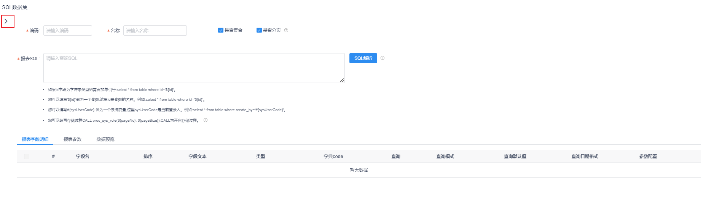
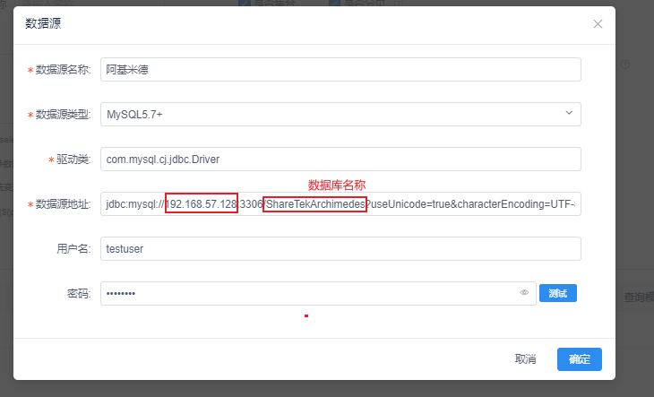
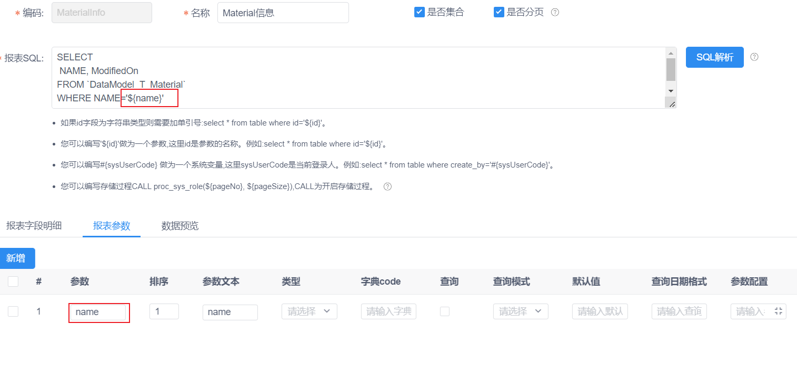
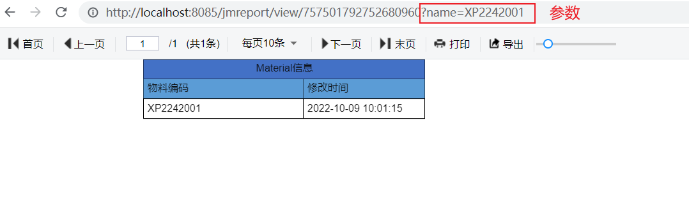

# 积木报表使用文档

## 环境配置

安装java

安装maven

## 快速搭建

### docker部署

1. 拉取项目

   ```shell
   git clone https://gitee.com/jeecg/JimuReport.git
   ```

2. 打包

   进入项目 jimureport-demo 根目录

   ```shell
   cd JimuReport/jimureport-example
   ```

   打包

   ```shell
   mvn clean package
   ```

3. 部署

   ```shell
   docker-compose up -d
   ```

4. 访问

   默认访问地址

   ```shell
   http://localhost:8085/jmreport/list
   ```

## 官方文档

http://report.jeecg.com

## 快速使用

### 普通报表

1. 新建数据报表

   

   

2. 创建数据源

   - 鼠标移动到数据集管理，点击`＋`选择SQL数据集

   

   - 点击`>` 可维护数据源，下拉可选择已添加数据源，搜索表

     

     1）新增数据源

     

     2）配置数据源

     > 不要选择mariadb类型，是个坑

     

     > 注意:使用公网ip，配置完成后可以点击测试ping一下

     

     3）选择数据源

     > 选择分页，报表页面可分页显示数据
     >
     > 未选择分页，报表页面显示全部数据

     

     4）填写编码、名称

     - 编码：SQL数据集的标识 **注：避免特殊字符和_**
     - 名称：SQL数据集的名称

     5）解析SQL

     

     6）确定

     一个数据集就建好了

     

3. 设计报表

   

4. 预览

   先保存，再预览

   

   效果

   

### 带参报表



url带上参数



### 图形报表

1. 新建数据报表

2. 创建数据源

3. 插入图表

   

4. 设置图表数据与样式

   1. 设置数据

      单击图标，选择数据

      

   2. 设置样式

      

### 二维码报表

1. 新建数据报表

2. 普通二维码

   插入一个二维码，设置二维码内容，可以为普通文本或url

   

3. 数据源二维码

   1. 新建数据源

   2. 字段拖入单元格

   3. 数据格式选择二维码

      第2步最终效果为第5步

      

### 主子报表

> SQL数据源

演示效果


设计步骤

新建一个名为`部门用户详情`的数据报表

> 创建两个表

> 第一张表名称为`部门`，数据结构：部门编号，部门名称，公司


> 第二张表名称为`员工`，数据结构：员工姓名、性别、年龄、入职日期、部门表的外键


1、为`部门用户详情`创建两个数据源

1.1 创建主表数据源

> 名称为`部门`


1.2 创建子表数据源

> 名称为`员工详情`


2、将主表、子表字段拖拽到设计器页面


3、重点来了->主子报表参数设置


- 名称：随意填写 `部门员工信息详情`
- 主表数据源：主数据源对应的名称`部门`
- 子表数据源：子数据源对应的名称`员工`
- 参数传递：子表参数：子数据源`员工`的参数;主表字段：主数据源`部门`对应的字段


> 保存预览即可


### 函数表达式

#### 数据集表达式（横向）

- sum | SUM

  对数据集字段数值求和，数据集为集合时只对横向求和有效

  可对多个值进行求和；如=sum(值1,值2,值3...)

  对数据集jm的字段money及extend_money求和

  `=sum(#{jm.money},#{jm.extend_money})`

- average | AVERAGE

  求平均值

- max | MAX

  求最大值

- min | MIN

  求最小值

- 基础运算符

  compute()内支持任意运算符计算

  >**注：当计算需要精确为小数时，字段值或者数值需为浮点类型；
  >如：2/5默认取整数0 如果想得到精确值0.4，则需要2.0/5；**

  jm为数据集编码，money、extend_money为数值字段

  - 加法运算：#{jm.compute(money+extend_money)}
  - 减法运算：#{jm.compute(money-extend_money)}
  - 乘法运算：#{jm.compute(money*extend_money)}
  - 除法运算：#{jm.compute(money/extend_money)}

#### 单元格表达式（竖向）

只针对当前页数据

- sum | SUM

  =sum(A6,C6) 对A6和C6单元格求和
  =sum(C6) 对C6单元格求和

- average | AVERAGE

- max | MAX

- min | MIN

#### 统计函数

操作数据集中的数据、

- DBSUM

  `=DBSUM(数据集编码.数据集字段)`

- DBMAX

  `=DBMAX(db.xx)`

- DBMIN

- DBAVERAGE

#### 行号函数

`=row()`

多个列表需要行号，需要设置一个**数字** 参数区分计数器
如： `=row(1)`

​		`=row(2)`

#### 日期函数

- =date()

  将字符串转换成日期型数据,要求格式为yyyy-MM-dd,时间部分都为00:00:00

  示例：
  例1：=date("1982-08-09") 返回日期：1982-08-09 00:00:00
  例2：=date("1982-08-09 10:20:30") 返回日期：1982-08-09 00:00:00
  例3：使用数据集或单元格
  集合：=date('#{jm.create_time}')
  对象：=date('${jm.create_time}')
  单元格：=date(A1)

- =time()

  stringExp HH:mm:ss格式的字符串

  示例：使用数据集或单元格
  集合：=time('#{jm.create_time}')
  对象：=time('${jm.create_time}')
  单元格：=time(A1)

- =now()

  获得系统此刻的日期时间,需要在设计页面配置单元格的时间格式

  

- =year()

  取得指定日期所在的年信息,dateExp 日期或标准日期格式的字符串

- =month()

  取得指定日期所在的月份,dateExp 日期或标准日期格式的字符串

- =day()

  从日期型数据中获得该日在本月中是几号，dateExp 表达式，其结果必须为日期或标准日期格式的字符串，如yyyy-MM-ddHH:mm:ss，yyyy- MM-dd，HH:mm:ss

  示例：
  例1：=day(datetime2("19800227","yyyyMMdd")) 返回：27
  例2：=day(dateTime(12345)) 返回：1
  例3：=day(dateTime("2006-01-15 10:20:30")) 返回：15
  例4：使用数据集或单元格
  集合：=day('#{jm.create_time}')
  对象：=day('${jm.create_time}')
  单元格：=day(A1)

- =nowstr()

  函数说明：返回当前时间

  返回值： 字符串

  示例： =nowstr() 返回结果 2021-07-28 16:31:30

#### 数学函数

- =rand()

  [0, 1.0)之间的一个随机数，浮点型

- =round()

  1. 函数说明： 对数据在指定位置上进行截取，剩余部分四舍五入
  2. 语法： round(numberExp, {nExp})
  3. 参数说明： numberExp 需要进行截取的数据 nExp 整数，用于指定需要进行截取的位置，>0：从小数点往右位移nExp个位数， <0：从小数点往左nExp个位数 =0：表示当前小数点的位置
  4. 返回值： 数值型
  5. 示例：
     例1：=round(3451251.274,0) 返回：3451251.0
     例2：=round(3451251.274,-1) 返回：3451250.0
     例3：=round(3451251.274,-2) 返回：3451300.0
     例4：=round(3451251.274,1) 返回：3451251.3
     例5：=round(3451251.274,2) 返回：3451251.27

- =abs()

  1. 函数说明： 计算参数的绝对值
  2. 语法： abs(numberExp)
  3. 参数说明： numberExp 待计算绝对值的数据
  4. 返回值： 数值型
  5. 示例：
     例1：abs(-3245.54) 返回：3245.54
     例2：abs(-987) 返回：987

- =floor()

  1. 函数说明： 对数据在指定位置向下进行截取，剩余部分只要有值全舍去
  2. 语法： floor(numberExp, {nExp})
  3. 参数说明： numberExp 需要进行截取的数据 nExp 整数，用于指定需要进行截取的位置，>0：从小数点往右位移nExp个位数， <0：从小数点往左移nExp个位数 =0：表示当前小数点的位置
  4. 返回值： 数值型
  5. 示例：
     例1：=floor(3451231.234,0) 返回：3451231.0
     例2：=floor(3451231.234,-1) 返回：3451230.0
     例3：=floor(3451231.234,-2) 返回：3451200.0
     例4：=floor(3451231.234,1) 返回：3451231.2
     例5：=floor(3451231.234,2) 返回：3451231.23

- =ceil()

  1. 函数说明： 对数据在指定位置向上进行截取，剩余部分只要有值就进位。
  2. 语法： ceil(numberExp, {nExp})
  3. 参数说明： numberExp 需要进行截取的数据 nExp 整数，用于指定需要进行截取的位置，>0：从小数点往右位移nExp个位数， <0：从小数点往左移nExp个位数 =0：表示当前小数点的位置
  4. 返回值： 数值型
  5. 示例：
     例1：=ceil(3450001.004,0) 返回：3450002.0
     例2：=ceil(3450001.004,-1) 返回：3450010.0
     例3：=ceil(3450001.004,-2) 返回：3450100.0
     例4：=ceil(3450001.004,1) 返回：3450001.1
     例5：=ceil(3450001.004,2) 返回：3450001.01

- =trunc()

  1. 函数说明： 对数据取整。
  2. 语法： trunc(numberExp})
  3. 参数说明： numberExp 小数
  4. 返回值： 数值型
  5. 示例：
     例1：=trunc(11.11) 返回：11
     例2：=trunc(-11.99)返回：-11

  ------

  **备注：除了固定值作为参数外，支持配置数据集表达式**
  错误用法：
  `=round("#{db.salary}", 2)`
  正确用法(不要带引号)：
  `=round(#{db.salary}, 2)` `=floor(#{db.salary}, 2)`

#### 字符串函数

- =char()
  - 函数说明：根据给定的unicode编码或者ascii码取得其对应的字符(一般来说，英文字符及其扩展字符都是ascii字符，中文、日文、韩文等亚洲字符都是unicode字符，ascii字符为8位，unicode字符为16位（其中有3位用于标志字符类型）)
  - 参数说明：int整数表达式，unicode编码或者ascii编码
  - 返回值：字符型
  - 示例：
    例1：=char(22269)返回：'国'
    例2：=char(101)返回：'e'

- =cnmoney()
  - 函数说明：数字转成大写金额（如果不填写则默认转换成大写金额） 单位可以为空，如果为空，则直接将 number 转换为人民币大写， 否则先将 number 与单位的进制相乘，然后再将相乘的结果转换为人民币大写。
  - 参数说明：第一个参数为数值类型，第二个为单位：'s','b','q','w','sw','bw','qw','y','sy','by','qy','wy' ， 分别代表'拾'，'佰'，'仟'，'万'，'拾万'，'佰万'，'仟万'，'亿'，'拾亿'，'佰亿'，'仟亿'，'万亿'。
  - 返回值：字符型
  - 示例：
    例1：=cnmoney(1.232)返回：壹元贰角叁分
    例2：=cnmoney(1.232,"b")返回：壹佰贰拾叁元贰角整
    例3：=cnmoney(1.232,"bw")返回：壹佰贰拾叁万贰仟元整
    例4：使用数据集或单元格
    集合：=cnmoney(#{jm.money})
    对象：=cnmoney(${jm.money})
    单元格：=cnmoney(A1)

- =concat()
  - 函数说明：对字符传进行拼接
  - 参数说明：传入字符串，用逗号拼接
  - 返回值：字符型
  - 示例：
    例1：=concat('hello ','word',' !') 返回：hello word !
    例2：使用数据集或单元格
    集合：=concat('#{jm.dept}','#{[jm.name](http://jm.name/)}') **引号不可省略**
    对象：=concat('${jm.dept}','hello') **引号不可省略**
    单元格：=concat(A1,B1)

- =lower()
  - 函数说明：将字符串转换成小写
  - 参数说明：传入字符串
  - 返回值：字符型
  - 示例：
    例1：=lower('ABCD') 返回：abcd
    例2：使用数据集或单元格
    集合：=lower('#{[db.name](http://db.name/)}') **引号不可省略**
    对象：=lower('${[db.name](http://db.name/)}') **引号不可省略**
    单元格：=lower(A1)

- =upper()
  - 函数说明：将字符串转成大写
  - 参数说明：传入字符串
  - 返回值：字符型
  - 示例：
    例：=upper('abcd') 返回ABCD
    例2：使用数据集或单元格
    集合：=upper('#{[db.name](http://db.name/)}') **引号不可省略**
    对象：=upper('${[db.name](http://db.name/)}') **引号不可省略**
    单元格：=upper(A1)

- =date_str()
  - 函数说明：将日期转成需要的字符串，只支持datetime、date、long类型、如果是datetime和date类型需要加上单引号,如果是long类型的，需要满足13位，如果不满足则会少几位添加几个0。
  - 参数说明：传入日期和自定义的编码
  - 返回值：字符型
  - 示例：
    例1：=date_str('2021-08-24 18:28:30','yyyyMMdd') 返回：20210824
    例2：=date_str('2021-08-24 18:28:30','HH:mm:ss') 返回：18:28:30
    例3：=date_str(1629942986000,'yyyy-MM-dd HH:mm:ss') 返回：2021-08-26 09:56:26
    例4：使用数据集或单元格
    集合：=date_str('#{db.date}','yyyy-MM-dd') **datetime和date类型引号不可省略**
    对象：=date_str('${db.date}') **datetime和date类型引号不可省略**
    单元格：=date_str(A1)

#### 条件表达式

- =case()
  - 函数说明： 对数据进行判断
  - 参数说明：case(expression,value,default) 表达式,值,默认值

| 参数       | 说明                                                         |
| :--------- | :----------------------------------------------------------- |
| expression | 一个判断语句，如'#{test.sex}'=='1' ,判断两边参数类型必须一致 |
| value      | 若expression返回true，则case表达式取该值                     |
| default    | 若expression返回false ，则case表达式取该值                   |

1. 示例：

   例1： =case('#{test.sex}'=='1','男','女')

   例2： =case(1==1,1,2) ->1

2. 注意：

   如果为字符串则需要加上单引号，如例1;

   如果为数值并且可能为空的话，那么你需要这样写`=case(intval(#{test.sex})==1,'1','2')` ；

   使用intval表达式的作用有：
   ①当#{test.sex}为空可以返回数值0，然后再和1比较；
   ②当#{test.sex}类型为字符串可以返回对应的数值，然后再和1比较；

```
let sex = 1;
return sex==1?'男':'女';
```

- =(if)

  - 函数说明：括号中可以写复杂的if运算符，也支持自定义变量 `let sex= '${sex}';`

    示例一：根据值动态翻译性别文本

```
=(let sex= '#{dd.sex}';
 if(sex== '1'){
     '男'
}elsif(sex== '2'){
    '女'
}else{
     '未知'
})
```

sex包括1，2，空，注意else if的写法为`elsif`

​		示例二： 根据删除标识，动态修改字的颜色和背景色。

```
=(let sex= '#{ccc.del_flag}'; 
if(sex== '0'){
   return  color('未删除','red','yellow');
}elsif(sex== '1'){
   return '已删除';
}else{
   return '未知';
})
```

返回`return`和结束`;`也可以不写。
效果：

示例三：if 支持固定单元格判断
	`=(if(A1==1){return (A1+B1)*200;})`
	注意：如果为数值并且为空的话，那么你需要这样写
`		=(let sex= intval(#{ccc.del_flag}); if(sex==1){return sex*200;})`
	intval为空返回0

------

斑马线使用示例

1.使用条件表达式实现列表斑马线的效果（如下）

操作步骤如下：

表达式说明：
`=case(#{aa_index+1}%2==0,rowcolor('#{aa.id}', '', '#eee'),'#{aa.id}')`

- case条件表达式传入三个参数,条件、条件值、默认值
- 条件：`#{aa_index+1}%2==0` aa是数据集的编码，`#{aa_index+1}`表示当前数据集循环的行数，除以2求余=0，表示偶数行条件成立。
- 条件值：`rowcolor('#{aa.id}', '', '#eee')`,rowcolor函数表示该单元格文本为`#{aa.id}`,单元格所在行的字体颜色不设置，背景颜色为`#eee`
- 默认值为`#{aa.id}`,即普通显示，此处要想用另一种背景色也可以用rowcolor函数。

### JS与Css增强配置

#### CSS增强

1.效果

> `查询按钮`的背景颜色改变


2.进入设计页面,在其他设置中点击增强配置


3.重点来了->为`查询按钮`设置样式

> 在css栏下编写样式代码，使`按钮背景颜色变成红色，边框也变成白色`


```
  .jm-query-form .ivu-btn-primary{
    background-color: red;
    border-color: red;
   }
```

4.注意事项

> 需要先找到按钮的原class即`.ivu-btn-primary`，然后加上表单顶层样式类`.jm-query-form`即可

> 如下图演示，先F12打开调试工具找到`元素（ELements）`，再定位


#### JS增强示例

1、实现三级联动

本例通过JS增强实现三级联动效果，来讲解JS增强用法。

1.1 效果展示


1.2 设计步骤

> 进入数据集配置页面，控件类型设置为 `自定义下拉框`,编码为`pca`


> 回到设计页面配置js增强


JS增强示例代码:

先定义一个init方法，在里面编写JS脚本。

```
function init(){
// 加载第1个下拉框数据
$http.metaGet('http://localhost:8080/jeecg-boot/ces/ai/customSelect').then(res=>{
  let options =  res.data;
  this.updateSelectOptions('pca', 'pro', options)
})
// 监听第1个下拉框改变事件 加载第2个下拉框数据
/*
* pca为数据源的key,pro是数据源key为pca的字段
**/

this.onSearchFormChange('pca', 'pro', (value)=>{
    let params = {params: {pid: value}}
    $http.metaGet('http://localhost:8080/jeecg-boot/ces/ai/customSelect', params ).then(res=>{
        let options =  res.data;
        this.updateSelectOptions('pca', 'city', options)
    })
})
// 监听第2个下拉框改变事件 加载第3个下拉框数据
this.onSearchFormChange('pca', 'city', (value)=>{
    let params = {params: {pid: value}}
    $http.metaGet('http://localhost:8080/jeecg-boot/ces/ai/customSelect', params ).then(res=>{
        let options =  res.data;
        this.updateSelectOptions('pca', 'area', options)
    })
})
}
```

1.3 功能说明

- 只能定义一个function，名称叫init
- 发起请求使用 `$http.metaGet`,请求参数格式如：`let params = {params: {pid: value}}`
- 监听控件值改变，使用`this.onSearchFormChange` 参数依次为： 数据集编码、字段名、回调事件，回调事件携带参数可获取到控件的值。*（这里只是说可以获取到控件的值，不一定是控件的值，也有可能是event对象）*
- 修改下拉框的选项：`this.updateSelectOptions`参数依次为：数据集编码、字段名、下拉选项数据

```
下拉选项数据格式为：
[{
value: '001',
text: '北京市'
},{
value: '002',
text: '天津市'
}]
```

- 接口最后返回的数据格式同上述下拉选项数据格式

------

2、实现修改查询表单初始值

2.1 效果展示

> 通过`js`增强设置`sex`为女


2.2 设计步骤

> 进入数据集配置页面，编码为`de`，并设置`sex`的查询默认值为`男`


> 进入预览页面，查看数据显示效果
> 

> 进入设计页面，配置js增强


```
// 增强代码
function init(){

    this.updateSearchFormValue('de', 'sex', '女')
}
```

进入预览页面，再次查看数据显示效果


2.3 功能说明

- 调用方法： **updateSearchFormValue**，该方法三个参数，说明如下：

| 参数      | 描述                         |
| :-------- | :--------------------------- |
| dbCode    | 数据集编码，如上例中的test   |
| fieldName | 数据集字段名称，如上例中的id |
| value     | 查询初始值，如上例中的2      |

- 如果是数值的范围查询可以通过|拼接开始结束值
  

```
function init(){
   this.updateSearchFormValue('dbCode', 'fieldName', '1|5')
}
```

- 如果是日期的范围查询，同上，只不过有个格式化需要配置，保证默认值的格式和配置的日期格式一致
  

```
function init(){
   this.updateSearchFormValue('dbCode', 'fieldName', '2021-08-01|2021-08-23')
}
```

- 日期范围查询条件配置当前月第一天及最后一天
  

```
function init(){
  var date=new Date();
  //获取当月第一天
  date.setDate(1);
  var month = parseInt(date.getMonth() + 1);
  var day = date.getDate();
  if (month < 10) {
	month = '0' + month
  }
  if (day < 10) {
	day = '0' + day
  }
  var start = date.getFullYear() + '-' + month + '-' + day;
  //获取当月最后一天
  var currentMonth=date.getMonth();
  var nextMonth=++currentMonth;
  var nextMonthFirstDay=new Date(date.getFullYear(),nextMonth,1);
  var oneDay=1000*60*60*24;
  var end = new Date(nextMonthFirstDay-oneDay)
 //赋值

  this.updateSearchFormValue('dbCode', 'fieldName', start+'|'+end)
}
```

------

3、设置下拉单选默认值的第一项

3.1 演示效果

> `sex`下拉框选中第一个`男`
> 

3.2 设计步骤

> 版本支持`version 1.4.0``date 20211020`

> 进入数据集配置页面，配置字段字典code、查询模式。【必须配置】


> 进入设计页面，配置js增强
> 

```
function init(){
    let ops = this.getSelectOptions('de', 'sex');
    if(ops && ops.length>0){
        this.updateSearchFormValue('de', 'sex', ops[0].value)
    }
}
```

3.3 功能说明

- 调用方法： **getSelectOptions**，该方法两个参数，说明如下：

| 参数      | 描述                           |
| :-------- | :----------------------------- |
| dbCode    | 数据集编码，如上例中的test     |
| fieldName | 数据集字段名称，如上例中的name |

- 调用方法： **updateSearchFormValue**，该方法三个参数，说明如下：

| 参数      | 描述                               |
| :-------- | :--------------------------------- |
| dbCode    | 数据集编码，如上例中的test         |
| fieldName | 数据集字段名称，如上例中的name     |
| value     | 查询初始值，如上例中的ops[0].value |

## 自定义

### 预览界面查询栏

设置默认展开


```
function init(){
  this.queryPanel = '1';
}
```

效果


### 纸张大小

配置文件中添加

JimuReport\jimureport-example\src\main\resources\application.yml

```yml
jeecg :
  jmreport:
    # 自定义预览界面每页显示条数
    pageSize:
      - 10
      - 20
      - 30
      - 40
      - 50
    # 打印纸张配置 title描述 size宽高
    printPaper:
      - title: A5纸
        size:
          - 148
          - 210
      - title: 轩田标签
        size:
          - 40
          - 20
```

重新部署


